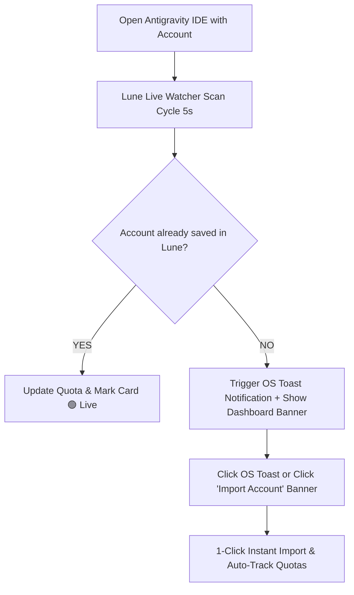

# Lune Project — Comprehensive Status & Progress Overview

## 📌 Executive Summary
**Lune** is a lightweight, zero-overhead desktop account & quota management suite built with **Electron**, **Vanilla JS**, and **HTML5/CSS3**. It enables seamless multi-account tracking for Google Antigravity IDE without launching extra IDE windows, forcing OAuth prompts, or spawning hidden virtual desktop environments.

---

## 🚀 Core Features & Capabilities

### 1. Zero-Spawning Passive Account & Quota Tracking
- **HTTP `/lsp/user_status` Process Inspection**:
  - Automatically discovers running Antigravity IDE `language_server` processes on Windows by scanning active TCP ports.
  - Queries local HTTP endpoints directly to fetch real-time authenticated account status, subscription plan details, model quota pools (Gemini 2.0 Flash, Gemini 1.5 Pro, Claude 3.5 Sonnet, GPT-4o), prompt credits, and flow credits.
- **Identity-Based Deduplication**:
  - Resolves recycled Windows PIDs and duplicate port bindings by verifying identity through HTTP email responses (`process.activeEmail`).

### 2. Multi-Channel Instant Account Import Flow
- **Native Windows Toast Desktop Notifications**:
  - Configured with `AppUserModelId` (`com.lune.app`) for reliable native OS notification delivery.
  - Clicking the notification brings Lune into focus and imports the detected account with 1 click.
- **Dashboard "New Account Detected" Panel**:
  - Prominent dashboard banner above the accounts list:  
    `⚡ New Account Detected: user@gmail.com [Import Account]`
  - Surfaces running unsaved accounts on your PC so you can import them anytime with 1 click without needing to open modal windows.

### 3. Simplified "+ Add Account" & Email Pre-Registration
- **Email Pre-Registration**:
  - Type any Google email (e.g. `user@gmail.com`) to pre-register an account card.
  - Shows status:  
    `⏳ Tracking will start after first login with this account`
  - As soon as you open Antigravity IDE logged into that email, Lune detects it, turns it **`🟢 Live`**, populates quota data, and tracks it automatically.
- **Zero Spawning Overhead**:
  - Completely removed hidden desktop spawning, background OAuth polling, and profile window creation.

### 4. Smart Account Card Sorting & Real-Time Status Indicators
- **Auto-Sorting**:
  - Accounts currently running in active Antigravity IDE instances automatically sort to the top of the left sidebar with a pulsing **`🟢 Live`** badge.
- **Frontend State Cleanup (Stale State Fix)**:
  - Every 5-second scan cycle, renderer receives the exact active accounts list and maps over **ALL** saved accounts. If an account is not in the active scan, its `isLive` status is explicitly set to `false`, demoted to inactive, and its DOM Live badge is removed immediately.
- **Zombie Process Filtering (Backend Orphan Fix)**:
  - PPID ancestor inspection in `lib/antigravity.js` identifies orphaned `language_server.exe` processes whose main `Antigravity IDE.exe` window was closed.
  - Orphaned ports are ignored, excluded from `/lsp/user_status` queries, and safely terminated via `taskkill` to free system memory.
- **Auto-Clearing Warnings**:
  - Transient active window warnings (e.g. `"Different account active in window"`) auto-clear after 3 seconds rather than sticking permanently.
- **Persistence & Auto-Backup**:
  - Persists accounts safely to `%APPDATA%\lune\accounts.json`.
  - Automatically creates timestamped rolling backups with automatic pruning of old backups.

---

## 🏗️ Architecture & File Structure

| File Path | Role & Purpose |
| :--- | :--- |
| **`main.js`** | Electron main process: manages app lifecycle, windows, IPC handlers (`detectRunningAccounts`, `saveAccounts`, `saveImportedAccount`), background watcher timers, and native OS desktop notification integration. |
| **`preload.js`** | Secure IPC context bridge: exposes safe window API methods (`window.api.loadAccounts`, `window.api.saveAccounts`, `window.api.detectRunningAccounts`, `window.api.onAccountImported`, `window.api.onTriggerDetectedImport`) between main process and renderer. |
| **`index.html`** | High-performance Vanilla JS & CSS UI: renders sidebar accounts list, quota cards, usage stats, model breakdown, email pre-registration modal, and dashboard detected account banner. |
| **`lib/antigravity.js`** | Process scanner & HTTP client helper: scans Win32 processes for `language_server.exe` listening ports, queries `/lsp/user_status`, builds account data objects, and handles process identity matching. |
| **`PROJECT_OVERVIEW.md`** | Official project progress, feature matrix, and architectural tracker for Lune. |

---

## 📊 Workflow Summary



---

## ⚙️ How to Run & Test
Run the following command in your terminal:
```powershell
npm start
```
